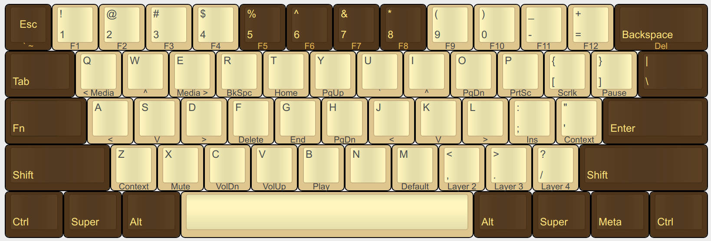

---
author: "hypersprite"
title: "Keepin' it on the home row"
date: "2018-03-20"
cover: "./images/poker-1965-rg.jpg"
category: "hobbies"
---

## What it took to finally get comfortable with keyboards

I spent more than half my life searching for the arrow keys and pressing the wrong button when I needed some extraneous key like `delete` and `esc` because they are different on almost every keyboard. The final straws were two keyboards from Microsoft: the Microsoft Sidewinder X4 and the Microsoft Sculpt Ergonomic. Both had the ESC key off in Siberia compared to my laptop and apparently I use the ESC key all the time.

Then I discovered keyboard layers via frgomes [Carpalx](https://github.com/frgomes/carpalx) which let me program my linux laptop to use the worthless CAPS LOCK as a function key and remap just about everything outside of the main alphas and base modifiers. So holding CAPS LOCK + ` is ESC, the F row moved down to the num row. Arrows are on both WASD and IJKL and Backspace and Delete are R and L. Home and End are right there at T and G. You get the picture. Honestly, I never even used Home and End before because their placement was so unreliable, but now I use them all the time.

Then I was introduced to the [Vortex Pok3r keyboard](http://www.vortexgear.tw/vortex2_2.asp?kind=47&kind2=220&kind3=&kind4=1023), a 60% keyboard with arbitrary key programing and a dip switch to turn CAPS LOCK into a function button. It also has mechanical switches, which in this case are Cherry MX brown. I never understood the obsession with mechanical switches until tried them and frankly, now every other keyboard I use feels like typing on a wet noodle.

I probably could have stopped right there, but then I got sucked down the [Massdrop](https://www.massdrop.com/mechanical-keyboards) hole of lusting after keycaps and custom cases. The picture at the top of this post is my Vortex Pok3r RGB with US made Signature Plastics 1965 keycaps from [KeyClack](https://www.keyclack.com/) and a Royal Glam 60% wood case. 

All I can say is, if you're frustrated by keys moving around on you, this might be the answer to the question you never knew to ask.