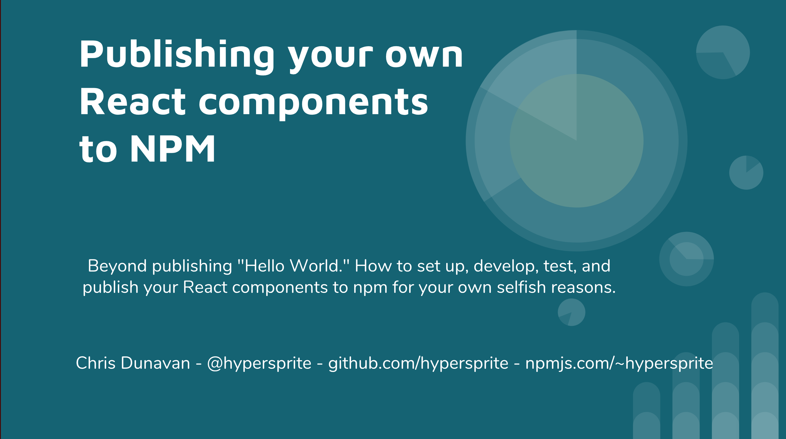

---
author: "Christopher Dunavan"
title: "Publishing your own packages to NPM (talk)"
date: "2018-05-08"
cover: "./images/hs-2830.jpg"
category: "tech"
---

I recently gave a talk at SouthBayReact regarding publishing React components to NPM. While React components were the focus, these techniques can work for all kinds of packages.

--- 

## Overview

Beyond publishing "Hello World". How to setup, develop, test, and publish your React components to npm for your own selfish reasons.

This talk presented by Christopher Dunavan, who started out, like a lot of us, sharing some custom functions and components between different projects by manually copying a file or two from one project to another. Then one day he wondered why wasn't he using NPM to manage this for him and what else he could leverage to make his code better and his life easier. 

---

## Slide Deck

## Resources:

### NPM Resources

* [npm-workspace](https://www.npmjs.com/package/npm-workspace) - If you need more control over your `npm link` you might like workspaces
* [npm dependencies](https://docs.npmjs.com/files/package.json#dependencies) - Fine-grained dependencies explanation
* [npm audit](https://blog.npmjs.org/post/173719309445/npm-audit-identify-and-fix-insecure)
* [npm publish](https://docs.npmjs.com/getting-started/publishing-npm-packages) - Video how-to on publishing for the first time
* [npm version](https://docs.npmjs.com/cli/version) - Allows for easier versioning of packages
* [npm outdated](https://docs.npmjs.com/cli/outdated) - Checks npm packages for versions 

### Other Resources 

* [Jest](https://facebook.github.io/jest/) - JavaScript Testing
* [Enzyme](http://airbnb.io/enzyme/) - Testing utility for React
* [Husky](https://www.npmjs.com/package/husky) - pre-commit and other hooks to help automate your workflow
* [eslint](https://www.npmjs.com/package/eslint) - Modern JavaScript linting
* [React Styleguidist](https://react-styleguidist.js.org/) - Styleguide
* [Cypress](https://www.cypress.io/) - End-to-end testing
* [Codesandbox.io](https://codesandbox.io/s/xp91vq473w) - For when words don't do it justice, make an example

### Basic starter used in example

* [My Basic Stateless Starter - github](https://github.com/HyperSprite/basic-stateless-starter) - A basic stateless starter setup with readme template and unit testing

Things found during research, but have not used yet

* [Gatsby docgen](https://www.gatsbyjs.org/packages/gatsby-transformer-react-docgen/?=docgen)
* [renovate](https://www.npmjs.com/package/renovate) - Dependency checking
* [updtr](https://www.npmjs.com/package/updtr) - Uses npm outdated to update packages like a robot
* [webpack: output library target](https://webpack.js.org/configuration/output/#output-librarytarget)

### My resources

* [npm](https://www.npmjs.com/~hypersprite) - my packages
* [github](https://github.com/HyperSprite) - my repos
* [portfolio](https://www.rcrsv.com)